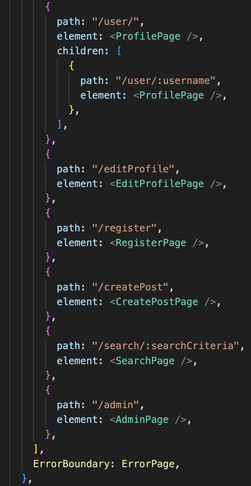

## Project Code
https://github.com/cph-sp428/sem4/tree/main/fullstack-exam

## Project Team Members 
- Sebastian Mandrup Petersen 

## Project Description
a basic clone of the instagram site with the following functionality
- users should be able to upload pictures ( or in my case a image link )
- users should be able to view the pictures of their friends ( following )
- users should be able to explore all pictures posted on the platform and follow those they decide to
- admin should be able to administrate posts that have been reported by users

## Project Prototype (Figma)

### Feed:

### Profile:

## Routes Documentation

### BACKEND 
- http://localhost:4000/graphql

### FRONTEND 

